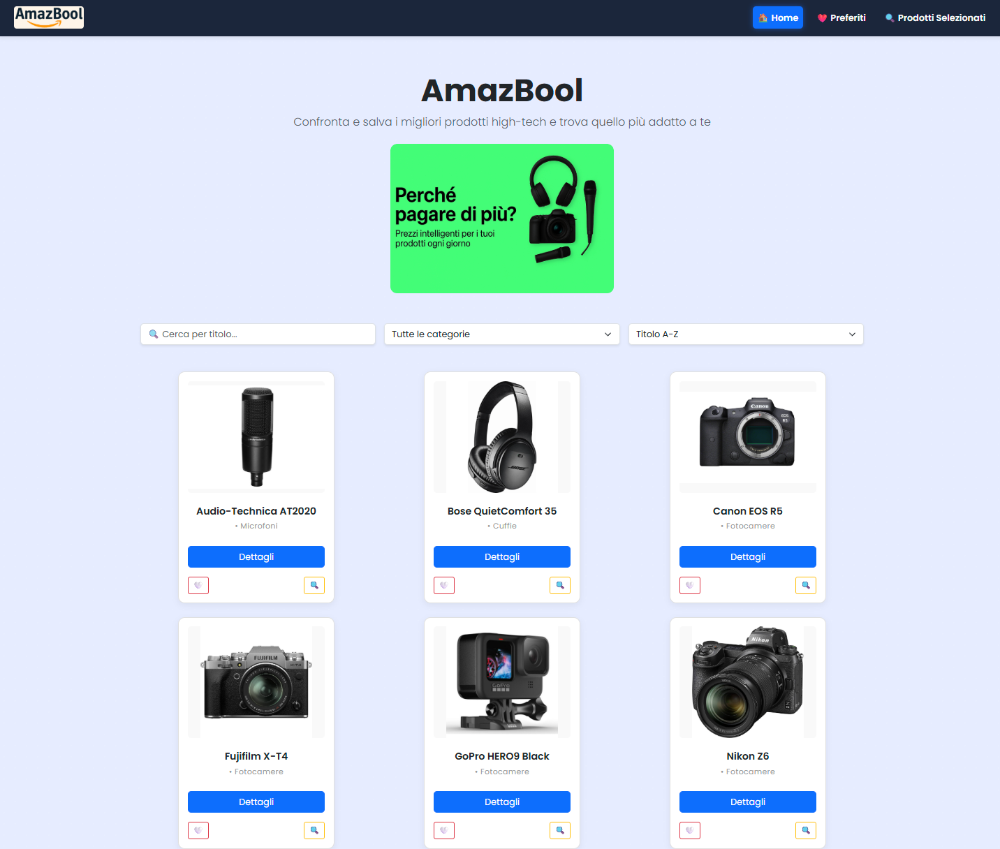

PROGETTO FINALE - Comparatore di Records
Il progetto finale del percorso con Boolean:
Il progetto consiste nel realizzare una SPA (single page application) con React, capace di visualizzare, cercare, filtrare, confrontare e salvare come preferiti diversi record.

Il backend è già pronto, e il mio compito è sviluppare tutta la parte frontend.

🎨 Tematica a Scelta:
✅ Mi è stata data libera scelta riguardo l’argomento da trattare, a condizione che rispettasse la necessità di avere entità con proprietà confrontabili.

🛠️ Backend Pronto All’Uso:
Mi è stato fornito un server backend progettato per gestire risorse definite dall’utente, con API REST complete per le operazioni CRUD.

🔧 Definizione delle risorse:
Il server si basa su un file types.ts in cui definire una o più risorse, a condizione che:

✅ Fossero esportate.
✅ Contenessero due proprietà di default e obbligatorie (title, category).
💡 Per ogni elemento product, il backend accetta le due proprietà fondamentali, più eventuali altre proprietà aggiuntive. Ad eccezione di id, createdAt e updatedAt (che vengono aggiunte in automatico dal server).

Il backend usa automaticamente il nome del tipo per generare:

Un file product.json nella cartella /database.
Endpoint REST: /products, /products/:id, etc.
🔧 Di seguito, le API REST disponibili per ogni tipo di risorsa:
POST /{tipo}s ➡️ crea un nuovo record. Vengono ignorate le proprietà id, createAt, updatedAt, se passate (vengono gestite autonomamente dal server). Restituisce il record completo.
GET /{tipo}s/:id ➡️ Restituisce un record per id. Restituisce errore se non trovato.
PUT /{tipo}s/:id ➡️ Aggiorna un record per id. Vengono ignorate le proprietà id, createdAt, updatedAt, se passate. Restituisce errore se non trovato.
DELETE /{tipo}s/:id ➡️ Elimina il record per id. Restituisce errore se non trovato.
GET /{tipo}s ➡️ Restituisce la lista dei record. Solo proprietà: id, createdAt, updatedAt, title, category (E ho aggiunto io price, perché necessario). Supporta query string:
❓​?search=... → cerca in title.
❓​?category=... → filtra per category.
🔧 Dove vengono salvati i dati:
Ogni risorsa viene salvata come file .json in /database. Esempio: se si definisce Product, il backend crea un file product.json.

✅ Si puo inserire i dati:

Tramite API (fetch, Postman, Thunder Client, etc.).
Manualmente nei file .json (rispettando la forma del tipo).
📌 Da richiesta, bisogna popolare ogni risorsa con almeno 10 record validi, per avere materiale sufficiente da confrontare.

🖼️ Cosa devo realizzare:
Una SPA in React che simula l'esperienza di un utente non autenticato, che può:

Sfogliare, cercare e filtrare record.
Confrontare più elementi tra loro.
Salvare i preferiti.
❌ Non può creare, modificare o cancellare record.

🔍 Tecnologie da utilizzare:
Utilizzare esclusivamente le tecnologie e le modalità viste durante il corso per sviluppare l'interfaccia e le funzionalità del progetto. È consentito l'uso di librerie esterne per la gestione dello styling, come ad esempio Tailwind CSS, Bootstrap, purché non alterino il comportamento logico dell'applicazione.

🏆 Requisiti Minimi:
Per considerare la completezza del progetto, devono essere implementate almeno queste funzionalità:

Gestione di una risorsa definita in types.ts.

Lista dei record, che mostra solo le proprietà principali title e category, e include:

Barra di ricerca per cercare nei titoli (title).
Filtro per categoria (category).
Ordinamento alfabetico per title o category (A-Z e Z-A).
Pagina di dettaglio per ogni record, con visualizzazione estesa delle sue proprietà (es. price, description, brand, ecc.).

Comparatore di 2 record, visualizzati affiancati per confrontarne le caratteristiche. È libera la modalità di selezione: puoi permettere all’utente di aggiungere record al comparatore direttamente dalla lista, dalla pagina di dettaglio, oppure usare un menu a tendina, checkbox o qualsiasi altro sistema. L’importante è che l’utente possa scegliere 2 record qualsiasi e confrontarli in modo chiaro.

Sistema di preferiti, sempre accessibile e aggiornabile:

L’utente può aggiungere o rimuovere record dai preferiti in qualsiasi momento.
I preferiti devono essere consultabili in ogni sezione dell’app (es. tramite una sezione dedicata, un’icona fissa, o una sidebar).
🎯 Requisiti Aggiuntivi (Facoltativi):
Da affrontare solo dopo aver completato i Requisiti Minimi:

Comparatore di 2 o più record: il layout si adatta per confrontare più elementi affiancati.
Debounce sulla ricerca, per migliorare la UX ed evitare chiamate API inutili.
Persistenza dei preferiti (es. salvataggio in localStorage), così che rimangano anche dopo il refresh della pagina.
Gestione degli stati vuoti, come:
Nessun risultato trovato'.
Lista preferiti vuota.
Nessun elemento selezionato nel comparatore.
🎯 Requisiti Avanzati (Facoltativi):
Da affrontare solo dopo i Requisiti Aggiuntivi:

Gestione di più risorse nella stessa SPA (es. products e courses), con interfacce distinte o integrate.
CRUD completo dal frontend:
Creazione di nuovi record.
Modifica di record esistenti.
Eliminazione di record.
Validazione dei campi in input.
🎯 BONUS (Facoltativo):
Da affrontare solo dopo i Requisiti Avanzati:

Riscrittura completa del progetto in TypeScript, per aggiungere tipizzazione forte, migliori strumenti di sviluppo e un’esperienza da progetto "enterprise-ready".
⏱️ Come affrontare il progetto:
📌 Obiettivo principale:
Completare tutti i Requisiti Minimi. Sono fondamentali:

❌ Anche uno solo mancante comporterà una penalizzazione all’esame, indipendentemente da quanti requisiti facoltativi siano presenti.

📌 Requisiti facoltativi?
I Requisiti Aggiuntivi, Avanzati e Bonus sono opzionali:

sono lì solo per arricchire il progetto se riesci a finire i Requisiti Minimi in meno di 7 giorni.

📌 Consegna del progetto:
Al momento del push finale del tuo progetto, ricordati di includere anche:

La cartella /database del backend, contenente i file .json generati per la tua risorsa.
Il file types.ts, con la definizione della risorsa (o delle risorse) utilizzate.